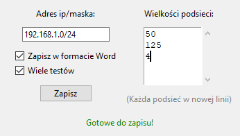

network_divider v3.1

# Program dzieli sieci na podsieci



Jeżeli ktoś nie chce gui a jedynie część vlsm to zapraszam do pliku vlsm.py

```python
def test():
    network = "192.168.1.255/24"
    needed = """
        64
    """
    error, val = validate(network, needed)
    if error:
        print('Wystąpił problem:', val)
    else:
        network, needed_subnets = val
        subnets = calculate_subnets(network, needed_subnets)
        print('Networks: ')
        for subnet in subnets:
            print(subnet.network)
            print(subnet.broadcast)
            print(subnet.first_address)
            print(subnet.last_address)
            print(subnet.allocated_size)
            print(subnet.mask)
```
Program zawiera podstawowe wykrywanie błędów.

## Exe zawarte w repozytorium!

Możliwość generowania sprawdzianów dal leni!

aby zbudować .exe wystarczy wpisać 

> pyinstaller builder.spec

Wymagane moduły:

> pip install docx
